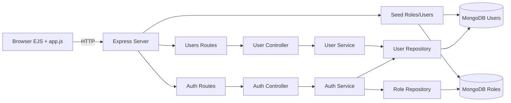
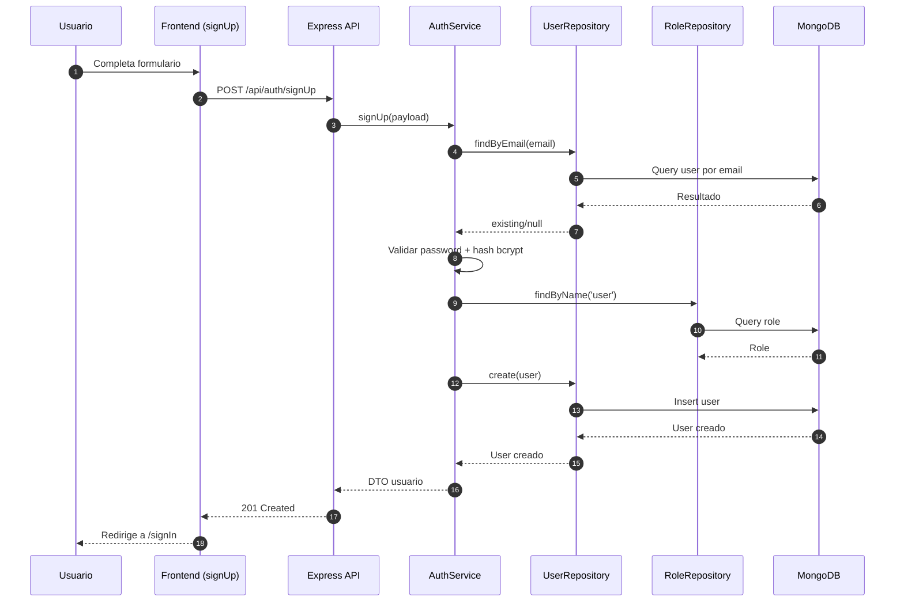
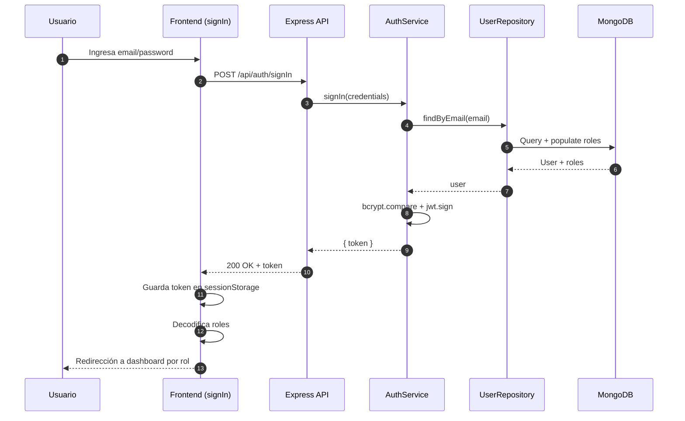
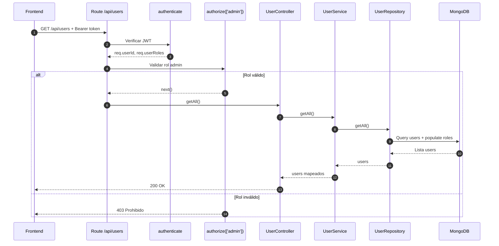
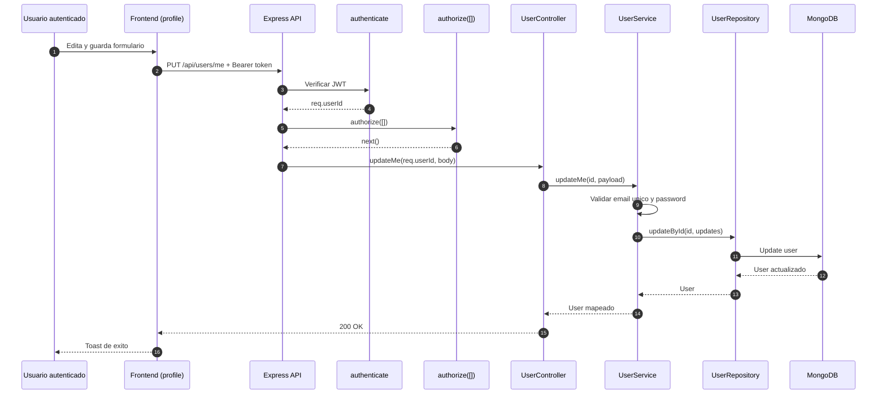
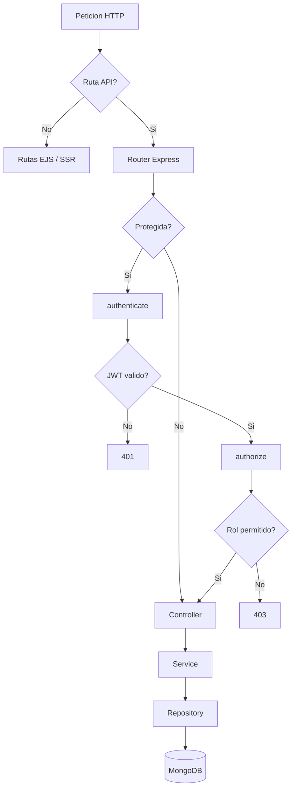
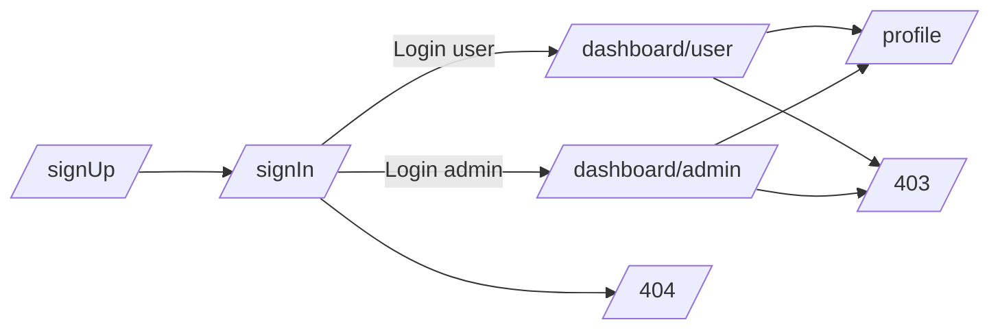
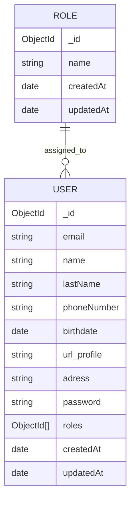

# DAWA Semana 07

Aplicación web full-stack con autenticación JWT, control de acceso por roles (`user`, `admin`) y gestión de perfil.

Incluye:

- API REST con Express + MongoDB (Mongoose)
- Capa de servicios/repositorios y middlewares de seguridad
- Frontend SSR con EJS + Materialize
- Flujo completo de registro, login, dashboard por rol y edición de perfil

## Tabla de contenido

1. [Stack y funcionalidades](#stack-y-funcionalidades)
2. [Arquitectura general (mapa)](#arquitectura-general-mapa)
3. [Secuencias de negocio](#secuencias-de-negocio)
4. [Estructura del proyecto](#estructura-del-proyecto)
5. [Mapa de rutas y seguridad](#mapa-de-rutas-y-seguridad)
6. [Mapa de navegación frontend](#mapa-de-navegacion-frontend)
7. [Diagrama de datos (ER simplificado)](#diagrama-de-datos-er-simplificado)
8. [Requisitos](#requisitos)
9. [Instalación y ejecución](#instalación-y-ejecución)
10. [Variables de entorno](#variables-de-entorno)
11. [Semillas iniciales (roles y admin)](#semillas-iniciales-roles-y-admin)
12. [Modelo de datos](#modelo-de-datos)
13. [API REST](#api-rest)
14. [Ejemplos curl listos para probar](#ejemplos-curl-listos-para-probar)
15. [Vistas web y rutas](#vistas-web-y-rutas)
16. [Manejo de autenticación en frontend](#manejo-de-autenticación-en-frontend)
17. [Estados esperados por pantalla](#estados-esperados-por-pantalla)
18. [Colección Postman](#colección-postman)
19. [Guía de pruebas rápidas](#guía-de-pruebas-rápidas)
20. [Evidencias y capturas de pantalla](#evidencias-y-capturas-de-pantalla)
21. [Troubleshooting](#troubleshooting)
22. [Checklist de seguridad mínima](#checklist-de-seguridad-minima)
23. [Guion de demo (5-8 minutos)](#guion-de-demo-5-8-minutos)
24. [Despliegue básico (referencial)](#despliegue-basico-referencial)
25. [FAQ rápido](#faq-rapido)
26. [Mejoras sugeridas](#mejoras-sugeridas)

## Stack y funcionalidades

### Backend

- Node.js + Express 4
- MongoDB + Mongoose
- JWT (`jsonwebtoken`)
- Hash de contraseñas con `bcrypt`
- Variables de entorno con `dotenv`

### Frontend

- EJS (render del lado servidor)
- Materialize CSS
- JavaScript vanilla para consumir API

### Funcionalidades principales

- Registro de usuario (`signUp`) con validación de contraseña robusta
- Inicio de sesión (`signIn`) y emisión de JWT
- Autorización por roles (`admin` / `user`)
- Dashboard de usuario y dashboard administrativo
- Consulta y actualización del perfil autenticado
- Seed automático de roles y usuario administrador

## Arquitectura general (mapa)



## Secuencias de negocio

### 1) Registro de usuario (`POST /api/auth/signUp`)



### 2) Inicio de sesión (`POST /api/auth/signIn`)



### 3) Acceso a ruta protegida (`GET /api/users`)



### 4) Actualizacion de perfil (`PUT /api/users/me`)



## Estructura del proyecto

```text
.
├── public/
│   ├── css/
│   └── js/
├── src/
│   ├── controllers/
│   ├── middlewares/
│   ├── models/
│   ├── repositories/
│   ├── routes/
│   ├── services/
│   ├── utils/
│   ├── views/
│   └── server.js
├── package.json
└── README.md
```

## Mapa de rutas y seguridad



## Mapa de navegacion frontend



## Diagrama de datos (ER simplificado)



## Requisitos

- Node.js 18+
- MongoDB local en ejecución

## Instalación y ejecución

```bash
npm install
```

```bash
npm run dev
```

Scripts disponibles:

- `npm run dev`: inicia con `nodemon`
- `npm start`: inicia en modo normal con `node`

Servidor por defecto:

- `http://localhost:3000`

## Variables de entorno

Crea un archivo `.env` en la raíz:

```env
PORT=3000
MONGODB_URI=mongodb://localhost:27017/auth_db
JWT_SECRET=f14e6a1c9843c52190c07232dfb9c0e467d5a910
JWT_EXPIRES_IN=1h
BCRYPT_SALT_ROUNDS=10
```

## Semillas iniciales (roles y admin)

Al iniciar el servidor:

- Si no hay roles, se crean `user` y `admin`.
- Si no existe el admin, se crea:
  - Email: `admin@example.com`
  - Password: `Admin#1234`
  - Roles: `user`, `admin`

## Modelo de datos

### Colección `roles`

Campos:

- `name`: `user | admin`

### Colección `users`

Campos:

- `email` (único, requerido)
- `name` (requerido)
- `lastName` (requerido)
- `phoneNumber` (requerido)
- `birthdate` (requerido)
- `url_profile` (opcional)
- `adress` (opcional)
- `password` (requerido, validado y hasheado)
- `roles` (array de ObjectId referenciando `roles`)

Regla de contraseña:

- Mínimo 8 caracteres
- Al menos 1 mayúscula
- Al menos 1 dígito
- Al menos 1 carácter especial entre `# $ % & * @`

## API REST

Base URL local:

- `http://localhost:3000`

### Health check

#### `GET /health`

Respuesta:

```json
{
  "ok": true
}
```

### Autenticación

#### `POST /api/auth/signUp`

Body de ejemplo:

```json
{
  "name": "Rafael",
  "lastName": "Lopez",
  "phoneNumber": "999888777",
  "birthdate": "1998-10-21",
  "email": "rafael@example.com",
  "password": "Rafael#123",
  "url_profile": "https://example.com/me.png",
  "adress": "Lima",
  "roles": ["user"]
}
```

Respuesta exitosa (`201`):

```json
{
  "id": "...",
  "email": "rafael@example.com",
  "name": "Rafael",
  "lastName": "Lopez"
}
```

#### `POST /api/auth/signIn`

Body de ejemplo:

```json
{
  "email": "rafael@example.com",
  "password": "Rafael#123"
}
```

Respuesta exitosa (`200`):

```json
{
  "token": "<jwt>"
}
```

### Usuarios (protegido)

Header requerido:

```http
Authorization: Bearer <token>
```

#### `GET /api/users`

- Acceso: solo `admin`
- Devuelve lista de usuarios mapeados

#### `GET /api/users/me`

- Acceso: cualquier usuario autenticado
- Devuelve perfil del token actual

#### `PUT /api/users/me`

- Acceso: cualquier usuario autenticado
- Actualiza perfil (no permite cambiar roles)

Body de ejemplo:

```json
{
  "name": "Rafael",
  "lastName": "Lopez",
  "phoneNumber": "999888777",
  "birthdate": "1998-10-21",
  "email": "rafael.updated@example.com",
  "url_profile": "https://example.com/new.png",
  "adress": "Arequipa",
  "password": "Nuevo#1234"
}
```

#### `GET /api/users/:id`

- Acceso: solo `admin`
- Devuelve detalle de un usuario por id

### Errores comunes

- `400`: validaciones o email repetido
- `401`: token ausente/inválido o credenciales incorrectas
- `403`: rol insuficiente
- `404`: usuario no encontrado o ruta inexistente

## Ejemplos `curl` listos para probar

### 1) Registro

```bash
curl -X POST http://localhost:3000/api/auth/signUp \
  -H "Content-Type: application/json" \
  -d '{
    "name":"Ana",
    "lastName":"Perez",
    "phoneNumber":"987654321",
    "birthdate":"1999-05-12",
    "email":"ana@example.com",
    "password":"Ana#1234",
    "url_profile":"",
    "adress":"Lima",
    "roles":["user"]
  }'
```

### 2) Login

```bash
curl -X POST http://localhost:3000/api/auth/signIn \
  -H "Content-Type: application/json" \
  -d '{"email":"ana@example.com","password":"Ana#1234"}'
```

### 3) Listar usuarios (admin)

```bash
curl -X GET http://localhost:3000/api/users \
  -H "Authorization: Bearer <TOKEN_ADMIN>"
```

### 4) Perfil propio

```bash
curl -X GET http://localhost:3000/api/users/me \
  -H "Authorization: Bearer <TOKEN>"
```

### 5) Actualizar perfil

```bash
curl -X PUT http://localhost:3000/api/users/me \
  -H "Authorization: Bearer <TOKEN>" \
  -H "Content-Type: application/json" \
  -d '{"adress":"Cusco","phoneNumber":"900111222"}'
```

## Vistas web y rutas

Rutas SSR disponibles:

- `/` redirige a `/signIn`
- `/signIn` inicio de sesión
- `/signUp` registro
- `/dashboard/user` dashboard de usuario (`user,admin`)
- `/dashboard/admin` dashboard de administración (`admin`)
- `/profile` perfil editable (`user,admin`)
- `/403` acceso denegado
- `/404` no encontrada

## Manejo de autenticación en frontend

La app web guarda JWT en `sessionStorage` y:

- Decodifica payload para extraer roles
- Redirige automáticamente tras login según rol
- Adjunta `Authorization: Bearer <token>` en cada fetch protegido
- Si recibe `401`, limpia sesión y vuelve a `/signIn`
- Si recibe `403`, redirige a `/403`

## Estados esperados por pantalla

### `signIn`

- Estado inicial: formulario vacío.
- Estado de error: toast con credenciales inválidas.
- Estado de éxito: guarda token y redirige por rol.

### `signUp`

- Estado inicial: formulario de alta.
- Estado de error: validaciones de backend (email, password).
- Estado de éxito: mensaje y redirección a `signIn`.

### `dashboard/user`

- Estado inicial: carga `/api/users/me`.
- Estado de éxito: tarjeta con datos y roles.
- Estado sin sesión/token vencido: redirección a `signIn`.

### `dashboard/admin`

- Estado inicial: carga lista `/api/users`.
- Acción: abrir modal de detalle por usuario.
- Estado sin rol admin: redirección a `403`.

### `profile`

- Estado inicial: precarga datos de usuario.
- Acción: actualizar datos y opcionalmente contraseña.
- Estado de éxito: toast de actualización.

## Colección Postman

Archivo generado:

- `docs/postman/DAWA-Semana07.postman_collection.json`

Incluye requests para:

- Health check
- `signUp`
- `signIn` admin y usuario
- `GET /api/users` (admin)
- `GET /api/users/me`
- `PUT /api/users/me`
- `GET /api/users/:id` (admin)

Variables incluidas en la colección:

- `baseUrl`
- `adminEmail`, `adminPassword`
- `newUserEmail`, `newUserPassword`
- `adminToken`, `userToken`, `sampleUserId`

Orden recomendado de ejecución:

1. `POST /api/auth/signUp`
2. `POST /api/auth/signIn (admin)`
3. `POST /api/auth/signIn (new user)`
4. `GET /api/users (admin)`
5. Requests restantes de `Users`

Notas:

- Los tests de Postman guardan automáticamente `adminToken`, `userToken` y `sampleUserId`.
- Si ya existe `newUserEmail`, cambia ese valor en variables antes de ejecutar `signUp`.

## Guía de pruebas rápidas

1. Inicia MongoDB local.
2. Ejecuta `npm install`.
3. Configura `.env`.
4. Ejecuta `npm run dev`.
5. Abre `http://localhost:3000/signIn`.
6. Prueba con admin semilla: `admin@example.com` / `Admin#1234`.
7. Verifica dashboard admin, perfil y listado de usuarios.

## Evidencias y capturas de pantalla

Se recomienda guardar las capturas en:

- `docs/screenshots/`

Checklist sugerido de evidencias para informe/demo:

1. Pantalla de login (`/signIn`)
2. Pantalla de registro (`/signUp`)
3. Login exitoso (redirección por rol)
4. Dashboard usuario (`/dashboard/user`)
5. Dashboard admin (`/dashboard/admin`)
6. Modal de detalle de usuario (admin)
7. Perfil editable (`/profile`)
8. Error 403
9. Error 404
10. Respuesta API en Postman/Insomnia (`signIn` con token)

Nombres sugeridos:

- `01-signin.png`
- `02-signup.png`
- `03-login-ok.png`
- `04-dashboard-user.png`
- `05-dashboard-admin.png`
- `06-admin-modal-user.png`
- `07-profile.png`
- `08-error-403.png`
- `09-error-404.png`
- `10-api-signin-token.png`

Evidencias extra recomendadas:

- `11-api-users-admin.png` (GET `/api/users` con admin)
- `12-api-users-me.png` (GET `/api/users/me`)
- `13-api-users-me-update.png` (PUT `/api/users/me`)
- `14-token-decoded.png` (payload JWT con roles)
- `15-mongo-users-collection.png` (datos persistidos)

## Troubleshooting

### Mongo no conecta

- Verifica que el servicio MongoDB esté levantado.
- Revisa `MONGODB_URI` en `.env`.
- Comprueba puertos y permisos locales.

### Siempre devuelve 401

- Revisa formato exacto del header `Authorization`.
- Confirma que `JWT_SECRET` sea el mismo al firmar y verificar.
- Verifica expiración del token (`exp`).

### Siempre devuelve 403 en admin

- Decodifica JWT y confirma que contenga `roles: ["admin", ...]`.
- Inicia sesión con el usuario semilla admin.

### Error de validación de contraseña

- Debe cumplir regex: `^(?=.*[A-Z])(?=.*\d)(?=.*[#\$%&*@]).{8,}$`.

## Checklist de seguridad minima

- [x] Password hasheado con bcrypt
- [x] JWT con expiración
- [x] Middleware de autenticación
- [x] Middleware de autorización por rol
- [x] Bloqueo de edición de `roles` en `updateMe`
- [ ] Rate limit
- [ ] Helmet
- [ ] Auditoría de intentos de login
- [ ] Refresh tokens / revocación

## Guion de demo (5-8 minutos)

1. Mostrar arquitectura y diagrama de capas.
2. Ejecutar app y explicar seed de admin.
3. Registrar usuario nuevo.
4. Iniciar sesión como user y mostrar dashboard/profile.
5. Iniciar sesión como admin y listar usuarios.
6. Mostrar llamada API protegida con token.
7. Cerrar con puntos de seguridad y mejoras.

## Despliegue basico (referencial)

Para desplegar en un entorno cloud:

1. Proveer MongoDB gestionado (Atlas u otro).
2. Configurar variables de entorno seguras.
3. Ejecutar en modo `npm start`.
4. Configurar reverse proxy (Nginx) y HTTPS.
5. Restringir CORS a dominios permitidos.

Variables recomendadas adicionales:

- `NODE_ENV=production`
- `CORS_ORIGIN=https://tu-dominio.com` (si implementas CORS estricto)

## FAQ rapido

### Se pueden crear usuarios admin por API?

Sí, actualmente `signUp` admite `roles` en payload. En producción conviene bloquear esta posibilidad o protegerla con un flujo administrativo autenticado.

### Por que se usa `sessionStorage`?

Es simple para laboratorio/demo. Para producción suele preferirse cookie `httpOnly` + `SameSite` + `Secure`.

### Por que hay `adress` y no `address`?

El proyecto lo maneja como `adress` en modelo, frontend y API. Mantener consistencia evita romper compatibilidad.

## Mejoras sugeridas

- Agregar refresh token y estrategia de revocación
- Implementar validación de input con esquema centralizado (Joi/Zod)
- Añadir pruebas unitarias/integración (Jest + Supertest)
- Añadir rate limit y headers de seguridad (Helmet)
- Migrar `sessionStorage` a cookies `httpOnly` si se requiere mayor hardening

---

Proyecto académico para practicar arquitectura por capas, autenticación JWT y autorización RBAC con Express + MongoDB.